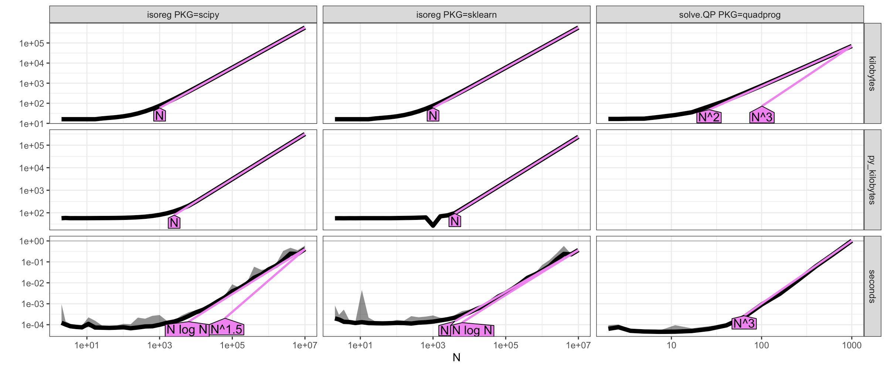
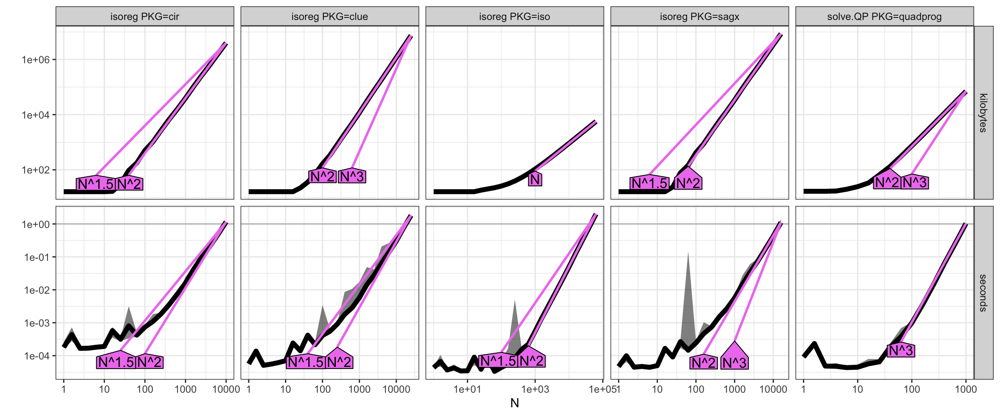
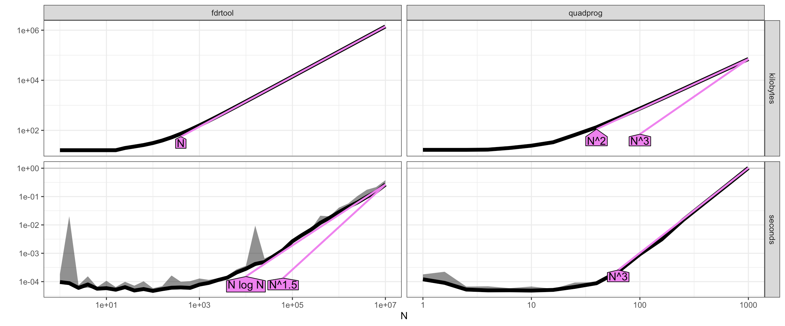
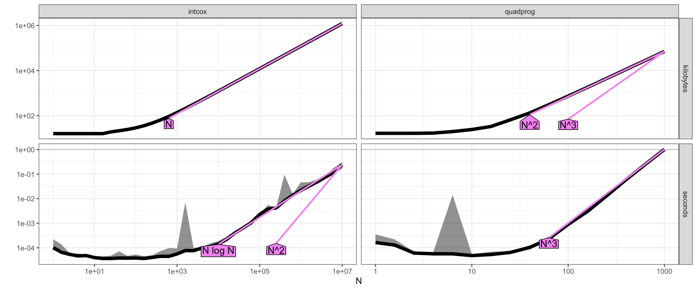
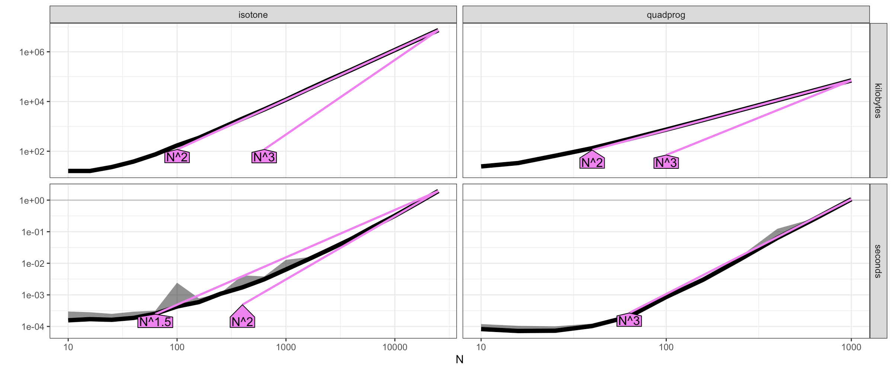
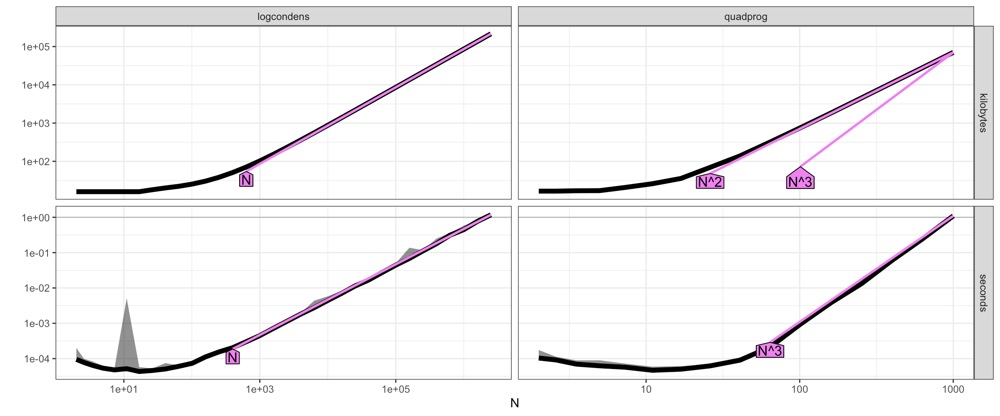

# 2026-09-17

## Hours worked: 3.5

## Description:
- Add full results after rerunning everything
- Add installation instructions for pre-2022 packages
- Add isoreg file from 2021 (as it is shipped directly with R)

## Appendix:

### Full results (current-day, latest versions)

`sklearn/scipy`

`cir/iso/clue/sagx`

`fdrtool`

`intcox`

`isotone`

`logcondens`

`sandwich`

`stats/directlabels/monotone/smacof`
