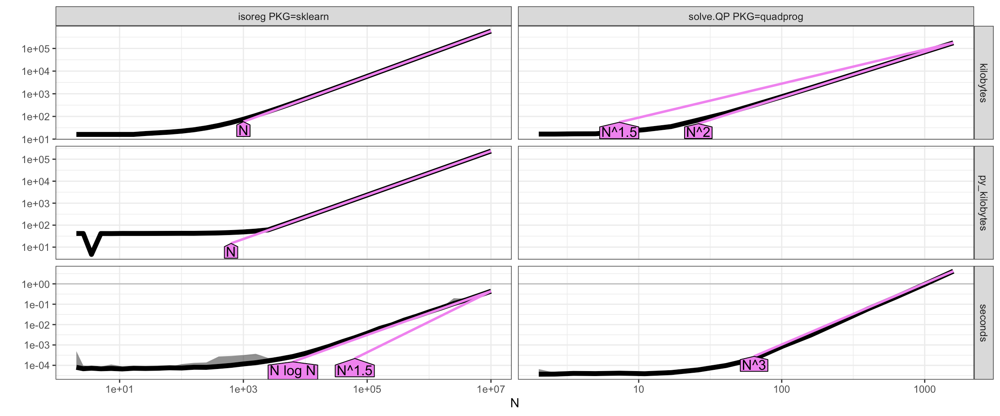
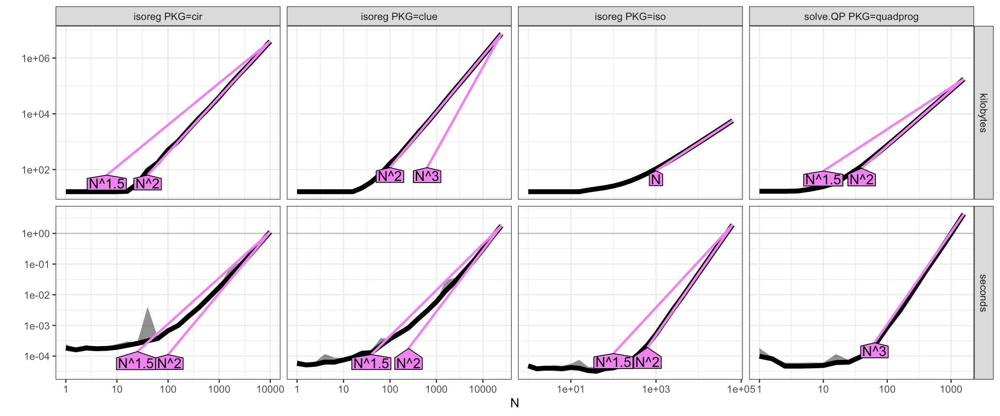
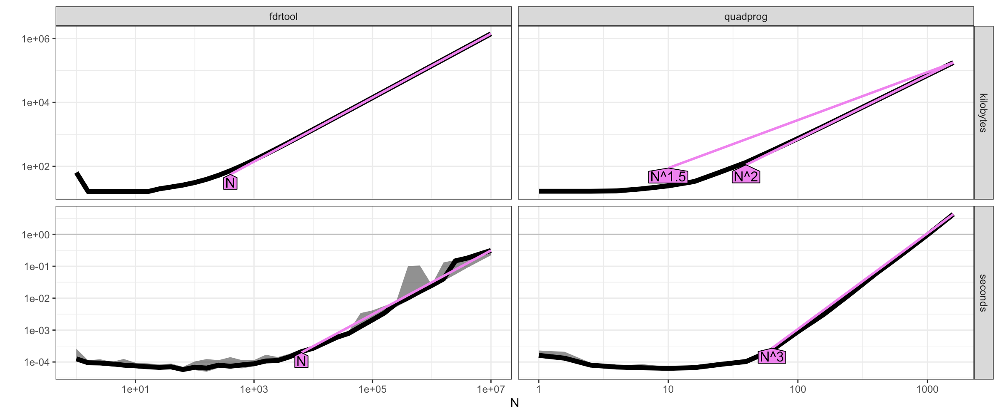
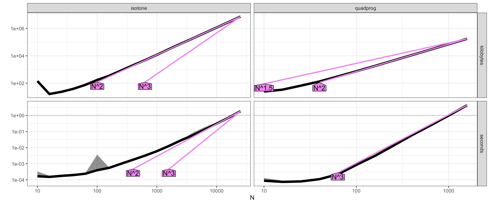
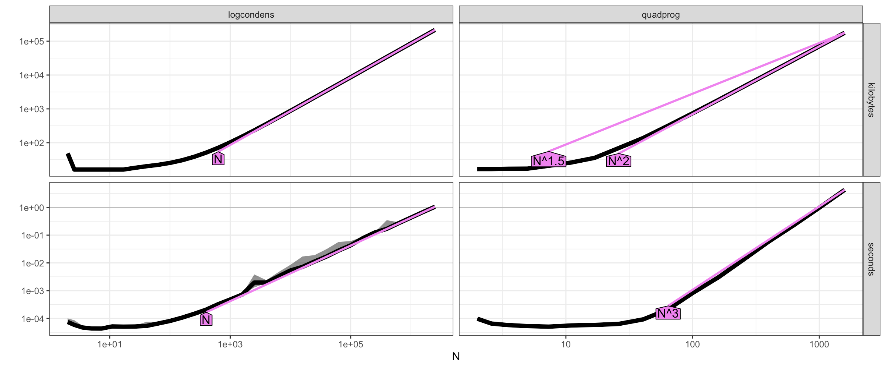
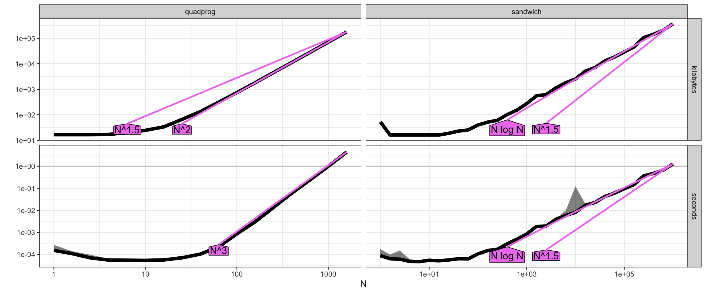
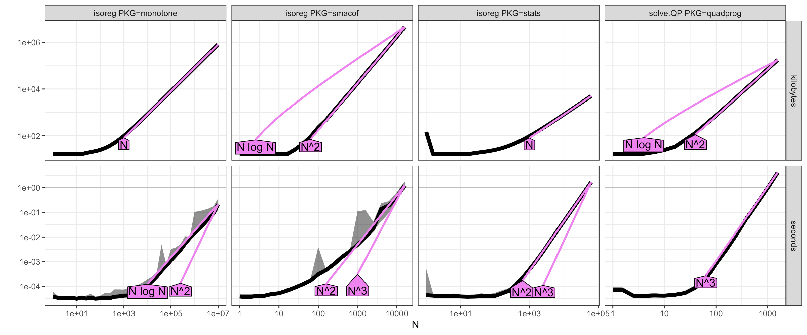

# 2026-09-18

## Hours worked: 6

## Description:
- Wrap up switching over to old function
- Add all results for old packages, both here and in the README
- Meeting with Pr. Hocking
- Start reading paper

## Appendix:

### Full results for older packages

#### `sklearn/scipy`
scipy is not present here, as it's `isotonic_regression` function arrived later.

#### `cir/iso/clue/sagx`
`SAGx` is not present in these results, as it was already a deprecated package

#### `fdrtool`

#### `intcox`
Not present here, as intcox was already a deprecated package

#### `isotone`

#### `logcondens`

#### `sandwich`

#### `stats/directlabels/monotone/smacof`
`directlabels` is not present here, as it's `isoreg` function only appeared in `directlabels` release 2026.8.27

