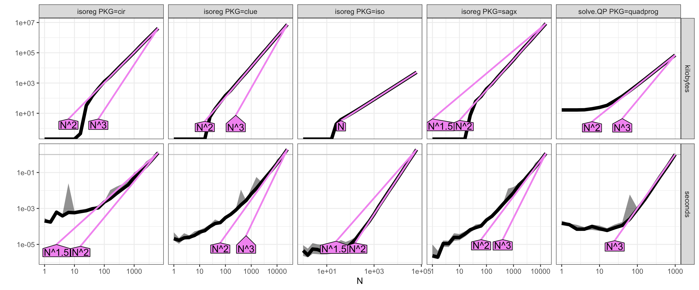
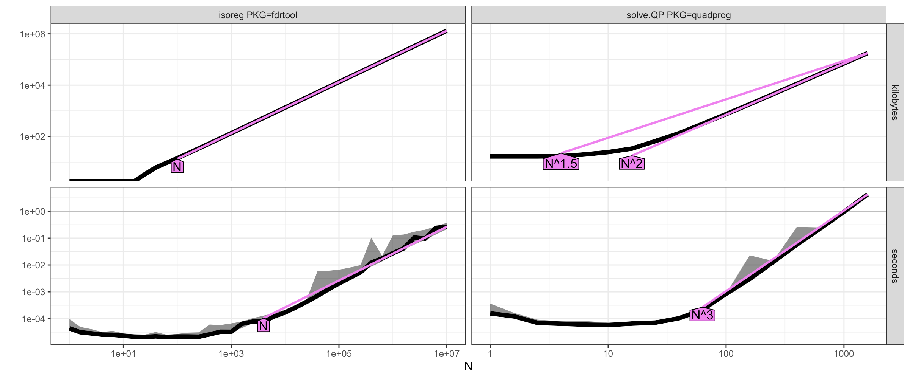
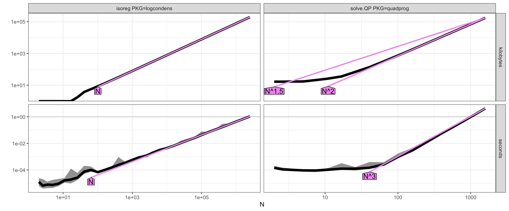
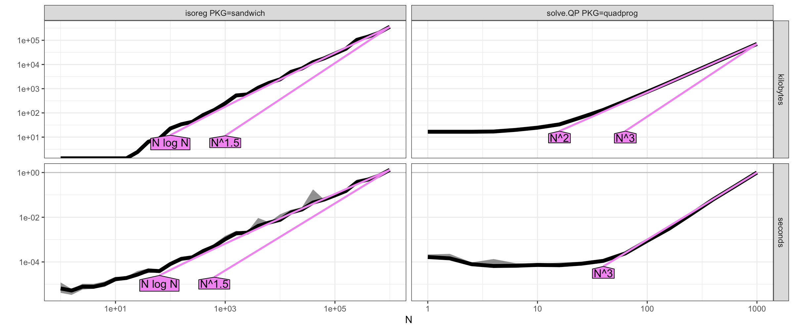
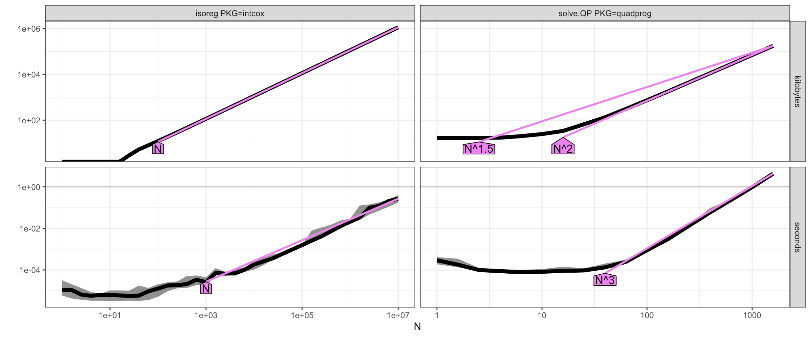
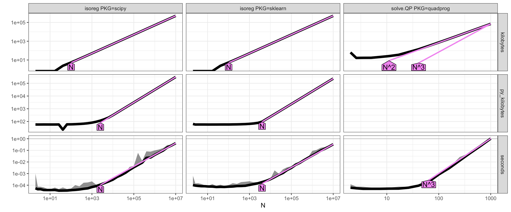
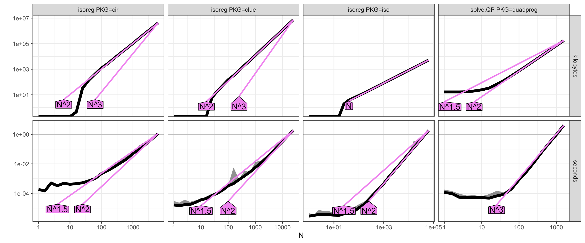
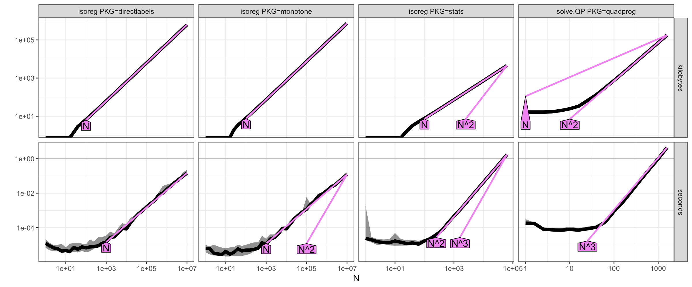

# Journal entries for the Pool Party project

## Total hours currently worked : 39 h (14.4 %)

## Total hours worked this week : 14 h

## 2026-09-09: 7h
### Description:
- Wrap up mandat de projet
- Add `SAGx` to cir/iso/clue extraction - last one that is dead simple, others will be slightly more complicated
- Add `fdrtool`, `logcondens`, `sandwich`, `intcox`, `smacof` results
- Make scripts for and add Python's `scipy` and `sklearn`

### Annex:
### `SAGx`

### `fdrtool`

### `logcondens`

### `sandwich`

### `intcox`

### `smacof`

### `scipy` and `sklearn`

## 2026-09-08: 3h
### Description:
- Add weights and bounds to all columns in table
- Add `cir`, `iso`, as well as `clue` PAVA functions results

### Annex:

## 2026-09-07: 4h
### Description:
- Implement mirror for GitHub
- Implement partitioning, template for adding functions, reproducibility
- Start working on table, added results for `stats`, `monotone`, `directlabels` packages

### Annex:

## 2026-09-04: 2h
### Description:
- Continuing adding links to table
- Meeting with Pr. Hocking

## 2026-09-02: 3h
### Description:
- Completion of the "contrat d'equipe"
- Work on the "mandat d'equipe"
- Initialization of the repository and CI for journalization
- Start looking at code, start putting links to functions

## 2026-08-01: 20h
### Description:
- Choosing project
- Meetings with Pr. Hocking
- Written description of the project, iterating over the one-pager
